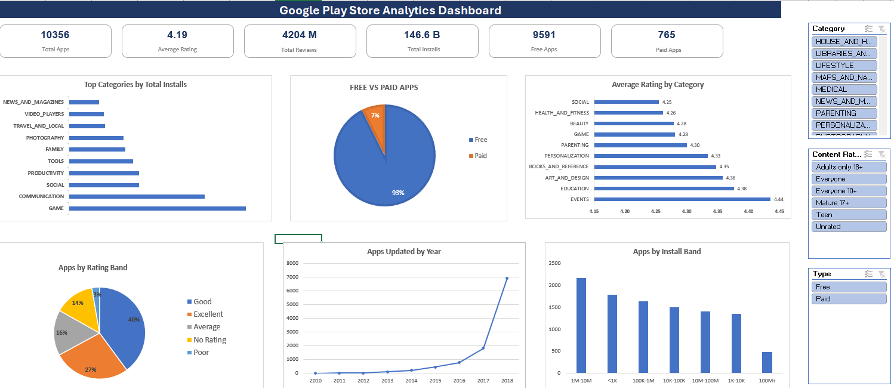

# 📊 Google Play Store Analytics Dashboard (Microsoft Excel)

## 📌 Project Overview

This project analyzes Google Play Store application data using **Microsoft Excel** to uncover trends in app popularity, user ratings, pricing strategies, and developer activity. The project demonstrates the complete Business Analytics workflow—from raw data cleaning and feature engineering to exploratory data analysis and an interactive dashboard.

The final dashboard enables users to dynamically explore the dataset using slicers while monitoring key performance indicators (KPIs) and business metrics.

---

## 📷 Dashboard Preview

> *(Add your dashboard screenshot here after uploading it to the Images folder.)*

---

## 🎯 Business Objectives

- Clean and prepare raw Google Play Store data for analysis.
- Transform data into meaningful analytical features.
- Analyze application performance across categories.
- Build interactive KPIs and dashboards.
- Generate actionable business insights for decision-making.

---

## 📂 Dataset

**Dataset:** Google Play Store Apps Dataset

**Source:** Kaggle

Files Used:
- `googleplaystore.csv`

> *(The user reviews dataset was downloaded for future enhancements but is not used in the current dashboard.)*

---

## 🛠 Tools & Skills Used

- Microsoft Excel
- Data Cleaning
- Feature Engineering
- Pivot Tables
- Pivot Charts
- Slicers
- KPI Design
- Dashboard Development
- Exploratory Data Analysis (EDA)
- Business Analytics
- Data Visualization

---

## 🧹 Data Cleaning

The following preprocessing steps were performed:

- Removed duplicate records
- Corrected the misaligned data row
- Checked missing values across all columns
- Converted installs into numeric format (`Installs_Clean`)
- Converted application size into MB (`Size_MB`)
- Standardized price values (`Price_Clean`)
- Standardized date fields
- Created a separate cleaned dataset

---

## ⚙ Feature Engineering

The following analytical features were created:

| Feature | Description |
|----------|-------------|
| Installs_Clean | Numeric install count |
| Size_MB | App size converted to MB |
| Rating_Band | Rating categories |
| Review_Band | Review count categories |
| Price_Clean | Numeric application price |
| Price_Band | Price segmentation |
| Update_Year | Extracted update year |

---

## 📈 Dashboard KPIs

| KPI | Value |
|------|-------:|
| Total Applications | 10,356 |
| Average Rating | 4.19 |
| Total Reviews | 4.204 Billion |
| Total Installs | 146.6 Billion |
| Free Applications | 9,591 |
| Paid Applications | 765 |

---

## 📊 Dashboard Visualizations

The dashboard includes:

- Top Categories by Total Installs
- Free vs Paid Applications
- Average Rating by Category
- Apps by Rating Band
- Applications Updated by Year
- Applications by Install Band

---

## 🎛 Interactive Filters

The dashboard supports dynamic analysis using slicers:

- Category
- Type
- Rating Band

---

## 💡 Key Insights

- Around **93%** of Play Store applications are free, while only **7%** are paid.
- **Game** and **Communication** categories generate the highest install volumes.
- The average application rating is **4.19**, indicating generally positive user feedback.
- Most applications fall within the **Good** and **Excellent** rating bands.
- Application update activity increases significantly in the later years represented in the dataset.
- Most applications belong to the **1M–10M** and **100K–1M** install bands, showing that only a small percentage achieve extremely high download volumes.

---

## 📌 Business Recommendations

- Focus product investments on high-demand categories while monitoring competition.
- Maintain high app quality to sustain strong ratings and improve discoverability.
- Optimize monetization strategies for free applications through ads, subscriptions, or in-app purchases.
- Encourage regular application updates to improve user engagement and compatibility.
- Analyze lower-rated applications to identify quality improvement opportunities.

---

## 🚀 Future Enhancements

- Build the dashboard in Power BI.
- Integrate the Google Play Store user reviews dataset for sentiment analysis.
- Automate data cleaning using Power Query.
- Develop predictive models for install growth trends.
- Add additional KPIs such as estimated revenue and category-wise pricing analysis.

---

## 🤖 AI Usage

Generative AI (ChatGPT) was used as a learning assistant to explain Excel concepts, suggest analytical approaches, review dashboard layouts, and improve documentation. All data cleaning, feature engineering, formulas, PivotTables, dashboard implementation, validation, and final business interpretations were completed, reviewed, and customized by the project author.

---

## 👩‍💼 Author

**Praachi Ajmera**

Master of Business Analytics | Monash University

Interested in Business Analytics, Data Analytics, Excel, Power BI, SQL, and Data Visualization.

---
